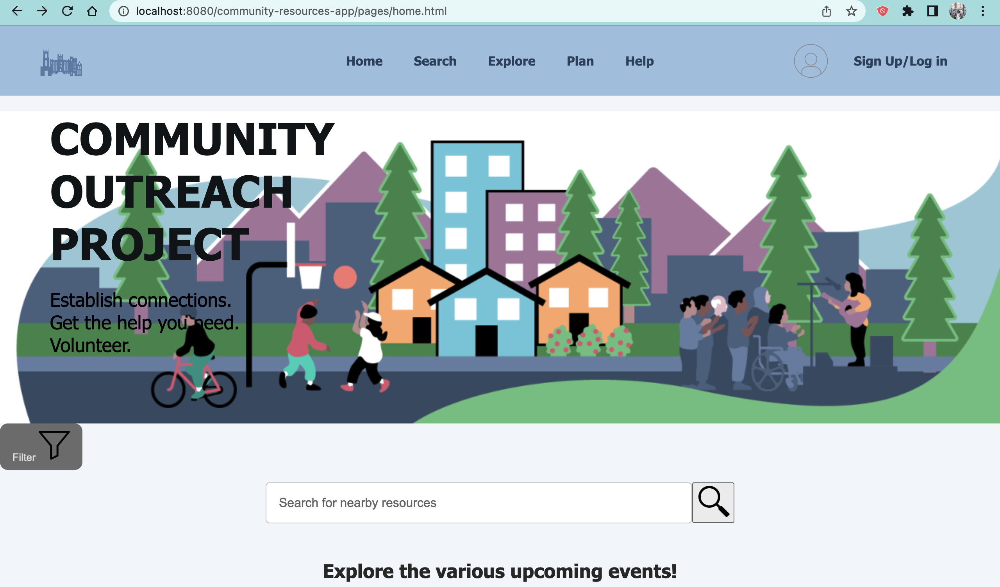

<p align="center"><i>COSC A451 Class Project Repository for 2025 Spring</i></p>
<h1 align="center">LOYNO Community Resource Map</h1>
<p align="center">A map that pinpoints any resources within a small radius of Loyola's campus (0–2 miles). Log in to search for places, favorite certain locations, host events, manage locations, and more.</p>


---

## Requirements

You will need:

- **Java Development Kit (JDK 17 only)**  
- Docker Desktop  
- Git Bash (for Windows users)  
- PostgreSQL  
- PostGIS  
- DataGrip (optional for viewing/managing the database)


---

## Steps for Deploying

1. Start Docker Desktop and ensure it is running.
2. Open a terminal in the project root directory.
3. Run the deployment script:

```bash
./scripts/deploy.sh all
```

This script will:
- Compile the web application  
- Package it into a WAR file  
- Spin up Docker containers and deploy the app to a Tomcat server


---

## Access the Application

Once deployment is complete, open your browser and go to:

[http://localhost:8080/community-resources-app/pages/home.html](http://localhost:8080/community-resources-app/pages/home.html)

You should see the home page for the LOYNO Community Resource Map.



---

## Timezone Verification (Optional)

Run this command to verify the database timezone:

```bash
psql -h localhost -U <your_postgres_username> -d community_app -c "SELECT NOW();"
```

**Example Output:**
```
              now              
-------------------------------
 2025-04-23 10:17:34.509495-05
(1 row)

-05 means US Central Time  
+00 means UTC
```

To check the timezone setting:

```bash
psql -h localhost -U <your_postgres_username> -d community_app -c "SHOW timezone;"
```

**Expected Output:**
```
 TimeZone  
-----------
 US/Central
(1 row)
```

